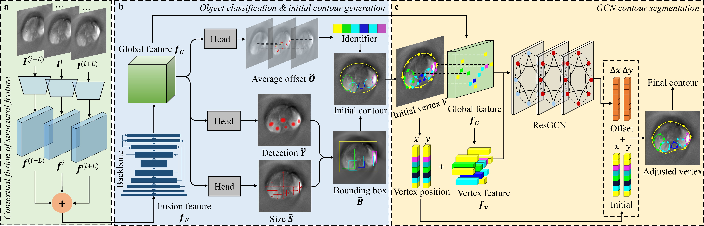

# CylinGCN: Cylindrical Structures Segmentation in 3D Biomedical Optical Imaging by a contour-based Graph Convolutional Network



> [**Organ-level instance segmentation enables continuous time-space-spectrum analysis of photoacoustic tomography images**](https://www.sciencedirect.com/science/article/abs/pii/S136184152400327X/)  
> Zhichao Liang, Shuangyang Zhang, Zongxin Mo, Xiaoming Zhang, Anqi Wei, Wufan Chen, Li Qi

This repository is the official implementation of "CylinGCN: Cylindrical Structures Segmentation in 3D Biomedical Optical Imaging by a contour-based Graph Convolutional Network".

Any questions or discussions are welcomed!

## Environments and Requirements

*   **Operating System**: [Ubuntu 20.04]
*   **CPU**: [Intel(R) Xeon(R) Platinum 8368]
*   **RAM**: [188GB]
*   **GPU**: [ NVIDIA A40]
*   **CUDA Version**: [12.8]
*   **Python Version**: [3.11]

To install requirements:

```bash
pip install -r requirements.txt
```

For detailed installation instructions, please refer to [INSTALL.md](assets/INSTALL.md).

## Dataset

*   **Data Source**: (https://huggingface.co/datasets/FLARE-MedFM/FLARE-Task2-LaptopSeg)
*   **Data Preparation**: The primary script for data preparation is `convert_nii_to_coco.py`. This script converts 3D NIfTI files (.nii.gz) for both images and segmentation masks into a 2D slice-based COCO dataset format. 
    *   **Key functionalities of `convert_nii_to_coco.py`**:
        *   Reads NIfTI images and corresponding NIfTI segmentation masks.
        *   For each NIfTI image, it extracts slices, rotates them (90 degrees counter-clockwise) to correct orientation, normalizes intensity (for images), and saves them as individual JPG files in the `JPEGImages` subfolder of the output COCO directory.
        *   It aims to produce 100 slices per original NIfTI volume. If a volume has more than 100 slices, it selects 100 evenly spaced slices. If it has fewer, it uses all available slices and pads by repeating the last slice to reach 100.
        *   For each corresponding NIfTI mask slice, it also rotates the slice, then converts the mask labels into polygon annotations (one for each distinct object/label per slice).
        *   These polygons, along with bounding boxes and areas, are stored in the `annotations.json` file in COCO format.
        *   The script can process an initial dataset and then append a pseudo-label dataset to the same COCO annotation file.
    *   **Input Data Structure (Expected by `convert_nii_to_coco.py`)**:
        The script expects separate directories for NIfTI images and NIfTI masks. For example:
        ```
        /path/to/nifti_data/
        ├── imagesTr/  # Contains image files like FLARE22_Tr_xxxx_0000.nii.gz
        └── labelsTr/  # Contains mask files like FLARE22_Tr_xxxx.nii.gz
        ```
    *   **Output COCO Data Structure**:
        The script generates a COCO-style dataset in the specified output directory:
        ```
        <output_coco_dir>/ (e.g., data/task/train/)
        ├── JPEGImages/     # Contains all extracted and processed JPG image slices
        └── annotations.json # COCO format annotation file for all slices
        ```
    *   The project's internal data structure after conversion typically looks like:
        ```
        data/
        ├── space/  # Example dataset name
        │   ├── test/ # COCO format test set
        │   │   ├── JPEGImages/
        │   │   └── annotations.json
        │   └── train/ # COCO format train set
        │       ├── JPEGImages/
        │       └── annotations.json
        └── task/   # Another example dataset name (can be 'task2' as per script)
            ├── test/
            │   ├── JPEGImages/
            │   └── annotations.json
            └── train/
                ├── JPEGImages/
                └── annotations.json
        ```

## Preprocessing (NIfTI to COCO Conversion)

The main preprocessing step involves converting the original 3D NIfTI dataset into a 2D slice-based COCO format, which is handled by the `convert_nii_to_coco.py` script. This script performs several operations:

*   **NIfTI to JPG Slices**: Extracts axial slices from 3D NIfTI images. Each slice is rotated, normalized (for images), and saved as a JPG file.
*   **Slice Sampling/Padding**: Ensures each original 3D volume results in 100 2D image slices for the COCO dataset. If an original volume has more than 100 slices, 100 are evenly sampled. If fewer, the last slice is repeated to reach 100.
*   **Mask to Polygon Conversion**: For each mask slice, it identifies distinct labeled regions and converts their boundaries into polygon coordinates suitable for COCO annotations.
*   **COCO Annotation Generation**: Creates an `annotations.json` file containing image information, category definitions, and segmentation annotations (polygons, bounding boxes, areas) for all processed slices.
*   **Orientation Correction**: Image and mask slices are rotated by 90 degrees counter-clockwise during processing to ensure correct orientation in the resulting JPGs and annotations.
*   **Dataset Merging**: The script supports initializing a COCO dataset or appending new data (e.g., from a pseudo-labeled set) to an existing `annotations.json` file.

To run the NIfTI to COCO conversion script, you would typically modify the paths within the `if __name__ == '__main__':` block of `convert_nii_to_coco.py` to point to your raw NIfTI image and mask directories, and specify your desired output COCO directory. Then, execute it:

```bash
python convert_nii_to_coco.py
```

For example, to process an original dataset and then append a pseudo-label dataset, the script might be configured and run as follows (conceptual, actual paths are set inside the script):

```python
# Inside convert_nii_to_coco.py (illustrative configuration)
if __name__ == '__main__':
    # Configuration for original dataset
    ORIGINAL_INPUT_NII_IMAGES_DIR = "/path/to/your/original/imagesTr/"
    ORIGINAL_INPUT_NII_MASKS_DIR = "/path/to/your/original/labelsTr/"
    OUTPUT_COCO_DIR = "/home/data/liangzhichao/Code/organseg/data/task/train" # Or your target COCO dir

    # Process original dataset (ensure this part is uncommented if running for the first time or to overwrite)
    # convert_nii_to_coco(ORIGINAL_INPUT_NII_IMAGES_DIR, ORIGINAL_INPUT_NII_MASKS_DIR, OUTPUT_COCO_DIR, "train_original", existing_coco_data=None)

    # Configuration for pseudo-label dataset (to append)
    PSEUDO_INPUT_NII_IMAGES_DIR = "/path/to/your/pseudo/imagesTr/"
    PSEUDO_INPUT_NII_MASKS_DIR = "/path/to/your/pseudo/labelsTr/"
    
    # Load existing data if appending
    existing_coco_content = None
    annotations_file_path = os.path.join(OUTPUT_COCO_DIR, "annotations.json")
    if os.path.exists(annotations_file_path):
        with open(annotations_file_path, 'r') as f:
            existing_coco_content = json.load(f)
            
    convert_nii_to_coco(PSEUDO_INPUT_NII_IMAGES_DIR, PSEUDO_INPUT_NII_MASKS_DIR, OUTPUT_COCO_DIR, "train_pseudo", existing_coco_data=existing_coco_content)
```

Make sure to adjust the paths `ORIGINAL_INPUT_NII_IMAGES_DIR`, `ORIGINAL_INPUT_NII_MASKS_DIR`, `PSEUDO_INPUT_NII_IMAGES_DIR`, `PSEUDO_INPUT_NII_MASKS_DIR`, and `OUTPUT_COCO_DIR` in the script to match your dataset locations and desired output path before running.

## Training

To train the model(s) in the paper, run this command:

```bash
python train.py --task space --input_mode space --dataset pat --arch dlagcnmulti_34 [add_other_relevant_hyperparameters_here]
```

*   Please specify the full training procedure and all relevant hyper-parameters used to achieve the reported results.
*   You can download trained models here: [Provide a link to download your trained model, e.g., Google Drive, Zenodo]

## Inference (Testing)

To run inference on test data, use the following command:

```bash
python test.py --demo <path_to_test_data_or_JPEGImages> --load_model <path_to_your_trained_model e.g., exp/checkpoints/task_arch/model_best.pth> --arch dlagcnmulti_34 --dataset pat --output_imgs [add_other_relevant_options_here]
```

*   `<path_to_test_data_or_JPEGImages>`: Specify the path to your test dataset or a directory of images.
*   `<path_to_your_trained_model>`: Specify the path to the pre-trained model weights.
*   The results (e.g., output images, segmentation masks) will be saved in a directory (e.g., `exp/results/imgs/` by default, or as specified by options).

## Acknowledgement

Our work benefits a lot from [CenterTrack](https://github.com/xingyizhou/CenterTrack#tracking-objects-as-points) and [DeepSnake](https://github.com/zju3dv/snake). Thanks for their great contributions.

We also thank the contributors of any public datasets used in this research.

## Citation

If you find this code useful for your research, please use the following BibTeX entry.

```bibtex
@article{Liang2024,
  title={Organ-level instance segmentation enables continuous time-space-spectrum analysis of pre-clinical abdominal photoacoustic tomography images},
  author={Liang, Zhichao and Zhang, Shuangyang and Mo, Zongxin and Zhang, Xiaoming and Wei, Anqi and Chen, Wufan and Qi, Li},
  journal={Medical Image Analysis},
  volume={101},
  pages={103402},
  year={2025},
  publisher={Elsevier} 
}
```
